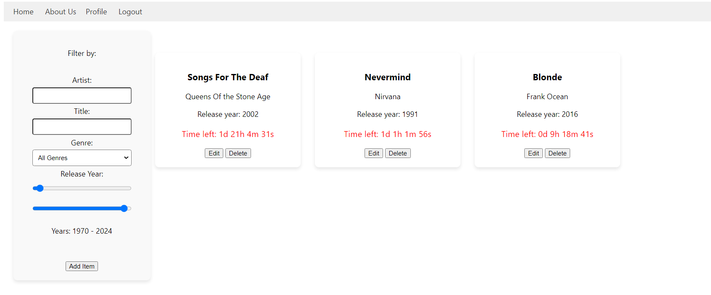

# Testing

> Place your test plan, test report and traceability matrix here

## Traceability matrix

### Functional

The table below shows an overview of which test covers which functional requirements

| Test | F1 | F2 | F3 | F4 | F5 | F6 | F7 | F8 | F9 | F10 | 
|:----:|:--:|:--:|:--:|:--:|:--:|:--:|:--:|:--:|:--:|:---:|
|  T1  | x  | x  | x  |    |    |    | x  |    | x  |     |
|  T2  |    |    |    |    | x  | x  |    | x  | x  |  x  |
|  T3  |    |    |    | x  |    |    |    |    |    |     |


### Non funtional

The table below shows an overview of which test covers which non-functional requirements

| Test | NF1 | NF2 | NF3 | NF4 | NF5 | NF6 | NF7 | NF8 | NF9 | NF10 | NF11 | NF12 | NF13 | NF14 | NF15 | NF16 | NF17 | NF18 | NF19 | 
|:----:|:---:|:---:|:---:|:---:|:---:|:---:|:---:|:---:|:---:|:----:|:----:|:----:|:----:|:----:|:----:|:----:|:----:|:----:|:----:|
|  T1  |  x  |  x  |  x  |  x  |  x  |  x  |  x  |  x  |  x  |  x   |  x   |  x   |  x   |  x   |  x   |  x   |  x   |  x   |  x   |
 
## Test plan
### De Scope
Ik ga tijdens het testen van mijn assignment focusen op de functionaliteit van de functionele en non-functionele requirements. 
Hierin is ook wel duidelijk gemaakt wat er exact getest moet worden. Vooral word getest welke functionaliteiten wel en niet goed werken.
### Test Strategy
Ik ga de tests deels handmatig uitvoeren, en deels automatisch. Veel functionele testing is al uitgevoerd in de REST testbestanden. 
Mocht een REST test ook een functionaliteit aanvinken, geef ik dat aan. Ik ga de tests opsplitsen in een aantal verschillende categorieen,
gebasseerd op welk deel van de applicatie samenhangt aan een bepaalde test.

## Test report
# Functional Tests
## T1
Met de eerste functionele test ga ik focussen op de functionaliteit van items & auctions.

Requirements: Items moeten bekeken kunnen worden in een lijst. Deze lijst moet zichtbaar zijn voor gebruikers.
Elke item in de lijst moet een naam bevatten, en een aantal attributen uniek aan de item. Ook moeten de items een lijst aan biedingen bevatten, en wanneer de auction is afgelopen.
Items moeten filterbaar kunnen zijn op een aantal attributen. In mijn geval zijn de unieke attribuut voor elk item:
 * Wie het album heeft gemaakt
 * Wanneer het album is gemaakt
 * Welk genre het album is
Ook moeten items gezocht kunnen worden op hun naam, oftewel de titel van het album. Biedingen die op een item staan mogen niet verwijderd worden. Als een bieding wordt toegevoegd, wordt dit ook real-time weergegeven.
Aangezien alle users in mijn applicatie mogen bieden (mits ze zijn ingelogd), kan er geen user bestaan die niet kan bieden. Daarentegen mogen alleen users met een admin role auctions wijzigen en beheren.

|                                      T1                                       | Success | Priority | Remarks |  
|:-----------------------------------------------------------------------------:|:-------:|----------|---------|
|                          Items kunnen bekeken worden                          |    x    | High     |         | | |
|                    Elke item in lijst heeft een naam & ID                     |    x    | High     |         | | |
|                  Elke item in lijst heeft unieke attributen                   |    x    | High     |         | | |
| Elke item heeft een aflopende timer die aanduidt hoelang de bieding nog loopt |    x    | High     |         | | 
|                       Er kan op elk item geboden worden                       |    x    | High     |         | 
|                  Items moeten gezocht kunnen worden op titel                  |    x    | High     |         | 

Zodra de webapplicatie is geopend, is dit het eerste wat de gebruiker ziet:

Hieraan zijn een aantal requirements al direct duidelijk: items kunnen bekeken worden, elke item heeft een naam en attributen, en elke item heeft een aflopende timer.
Als er op een item word geklikt, komt de itemDetails pagina in beeld:


Normaliter is hier rechts een overzicht van alle biedingen te zien, maar aangezien de gebruiker niet is ingelogd kunnen er nog geen biedingen geplaatst worden.
Als we terug gaan naar het hoofdscherm, kunnen we filteren op de attributen van de items, als volgt:

Op artiest:


Op titel:


Op genre:


En op release jaar:


Hiermee is duidelijk te maken dat alle basisfunctionaliteit in de applicatie werkt naar behoren.

## T2
Met de tweede tests gaan we kijken naar de validatie en sanitering van clientside en serverside input. Neem als voorbeeld de registreerpagina:

Als er een veld mist om een gebruiker te registreren, word er een melding getoond dat er nog een veld ingevuld moet worden. Dit gebeurd door de <input required> tags in HTML.
Laten we een gebruiker aanmaken.


Zodra alle data is ingevuld, kunnen we de gebruiker aanmaken:

Zonder opnieuw in te loggen komt de gebruiker terecht op de hoofdpagina. De gebruiker mag nu ook biedingen plaatsen. Dat gaat zo te werk:


In de itemDetails pagina is er nu een inputveld vrijgekomen: om biedingen te plaatsen. Er kan alleen geen bieding geplaatst als die lager dan 0 is, of lager is dan de hoogste bieding.
Desondanks dat er nu geen biedingen zijn, kan er geen bieding geplaatst worden aangezien deze lager of gelijk is aan 0. Zodra de gebruiker een getal invult wat hoger is dan 0, mag dat wel:


En als de gebruiker op de 'Add Bid' knop klikt, komt de bieding direct tevoorschijn:


Ook andere gebruikers krijgen deze bieding te zien:


Als de gebruiker als admin inlogt, krijgen ze ook een aantal extra knoppen te zien:



Om items aan te passen, toe te voegen en te verwijderen. Deze kunnen ook alleen maar gebruikt worden door de admin, dankzij mijn middleware. Hiervoor heb ik ook REST tests geschreven die dit confirmen.
Hierdoor weet ik dat mijn input ook in de backend geverifieerd wordt. Daarbovenop heb ik ook andere tests geschreven die dit checken:

```http request
### Add an invalid bid (lower than current highest bid)
POST http://localhost:3000/api/items/1/bids
Authorization: Bearer {{userToken}}
Content-Type: application/json

{
  "amount": 50,
  "highestBid": 100
}

> 
```
Deze tests zijn ook succesvol.

| T2                                                       | Success | Priority | Remarks                                    |
|----------------------------------------------------------|---------|----------|--------------------------------------------|
| Input is gevalideert aan de clientside                   | X       | High     |                                            |
| Input is gevalideert aan de serverside                   | X       | High     | Additional confirmation through HTTP tests |
| Bids worden ge-update als een gebruiker een bid toevoegt | X       | Medium   |                                            |
| Alleen ingelogde gebruikers mogen bids toevoegen         | X       | High     | Additional confirmation through HTTP tests |
| Alleen admins mogen items aanpassen                      | X       | High     | Additional confirmation through HTTP tests |

## T3
Ten slotte kunnen bids niet verwijdert of aangepast worden zodra ze zijn geplaatst. Aangezien hier letterlijk geen functionaliteit voor is in mijn applicatie, weet ik vrij zeker dat dit werkt.

Hier is nergens functionaliteit voor de gebruiker om een bid aan te passen of om te verwijderen. Ook zijn hier geen routes of API endpoints voor.

| T3                                                        | Success | Priority | Remarks |
|-----------------------------------------------------------|---------|----------|---------|
| Bids kunnen niet aangepast worden nadat ze zijn geplaatst | X       | High     |         |   

# Non-functional Tests
NF1: The API returns valid JSON objects or arrays.
Uit Postman:


NF2: The API return appropiate HTTP status codes
Ten eerste is dit getest in mijn HTTP tests. Maar daarbovenop:

En ook als er een foute response ge-returned moet worden:
 (Hier is de admin voor nodig)

NF3: The API uses the correct HTTP verbs for its operations.<br>
Zoals heirboven aangegeven, zijn de verbs correct. Er wordt een GET request gemaakt als items gefetched moeten worden, en een PUT om een item aan te passen.

NF4: The API implements at least ReST level 3
Het is me helaas niet gelukt om rest level 3 toe te passen. Al vind ik het wel gek dat dit niet is benoemd in de les! Aparte requirement.

NF5: The API uses query parameters for filtering the result set
Ook dit is me helaas niet gelukt (en de volgende functionalities over query filtering & sorting) al vindt ik dit ook een aparte requirement, gezien dat we Svelte gebruiken en onze applicatie kleinschalig is.

NF8: Both front-end and backend provide descriptive error messages.
Met de functionele tests heb ik aangeduid dat mijn backend dit inderdaad doet. Met mijn HTTP tests heb ik aangeduid dat mijn backend dit doet.

NF9: Both front-end and backend apply the SoC principle.
They do indeed.

NF10: API endpoints have meaningful good and bad weather tests.
In mijn HTTP tests heb ik tests gemaakt die aftrappen als alles goed gaat, maar ook al er dingen fout gaan, zoals Unauthorized of Forbidden endpoints.

NF11: The traceabilty matrix, test plan and test report are documented in testing.md
They are indeed.

NF12: After registration the user should be logged in. They should not have to log in again before being able to place a bid
Met de functionele tests heb ik aangeduid dat dit klopt.

NF13 & NF14
Both of these are applicable.

NF15: The front-end is composed of re-usable components using a logical structure.
Mijn itemModal, die wordt gebruikt om items toe te voegen en te editen, hergebruik ik. Ik hergebruik ook een timerComponent om de tijd op auctions te laten zien,
een messageComponent voor foutmeldingen en een bidComponent om biedingen te laten zien.

NF16: The API uses JWT for authorization.
Dat doet het zeker. In mijn backend is op verschillende plekken het gebruik van JWT te zien, bijvoorbeeld mijn authorization middleware:

```js
export function requireAdmin(req, res, next) {
    const authHeader = req.headers.authorization;
    if (!authHeader) {
        return res.status(statusCodes.UNAUTHORIZED).json({ message: 'Authorization header missing' });
    }
    const token = authHeader.split(' ')[1];

    try {
        const decoded = jwt.verify(token, 'secret-key');
        if (decoded.userRoles && Array.isArray(decoded.userRoles) && decoded.userRoles.includes('admin')) {
            next();
        } else {
            return res.status(statusCodes.FORBIDDEN).json({ message: 'Forbidden' });
        }
    } catch (error) {
        console.error(error);
        return res.status(statusCodes.UNAUTHORIZED).json({ message: 'Unauthorized' });
    }
}
```

NF17: The API uses Bcrypt for password hashing
Ook dat doe ik zeker, zie het volgende uit mijn registreer systeem in authUserController:
```js
// Hash the password before storing it
const hash = await bcrypt.hash(password, saltRounds);

user_id++;
// Add the new user to the array
users.push({
    username,
    email,
    hash,
    user_roles: ['user'],
    user_id: user_id.toString(),
    won_auctions: [] // Initialize with an empty won_auctions array
});

console.log(`User ${username} registered successfully!`);

return res.status(statusCodes.OK).json({ message: 'User registered successfully!' });
} catch (error) {
    res.status(statusCodes.INTERNAL_SERVER_ERROR).json({ message: 'Something went wrong during registration!' });
}
```

NF18: The system uses role-based authentication and authorization
Dat doet het zeker. Dit heb ik aangeduid in mijn HTTP tests.

NF19: Users can have multiple roles.
Dat kunnen ze. Mijn gebruikers hebben een roles array waaraan toegevoegd en verwijdert kan worden. 
Ik heb hier alleen geen functionaliteit voor aan mijn clientside, aangezien dit ook geen vereiste was en ik niet noodzakelijk vond.

